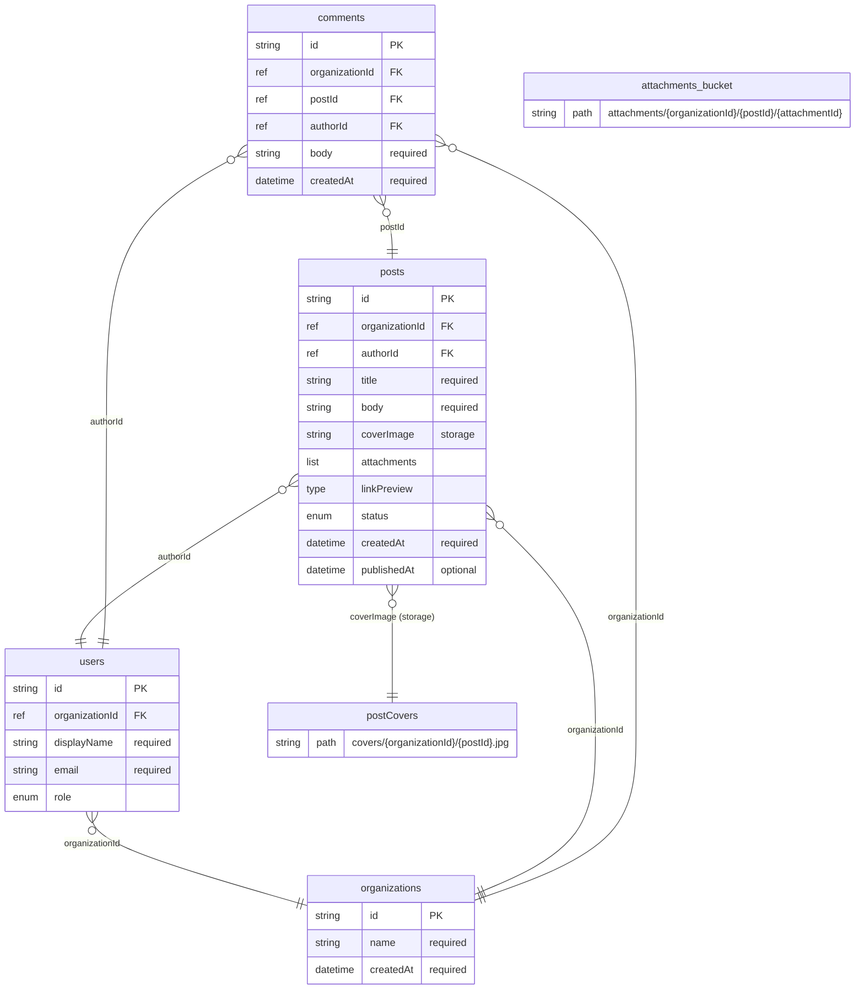

<div align="center">

# 🔥 firepack

### One YAML spec → your entire Firestore data layer.

**Stop hand-writing the 9-file fan-out for every new field.**
Typed Dart models, Riverpod providers, repositories, security rules,
indexes, storage paths, and a Mermaid graph — generated deterministically,
on every save.

[](LICENSE)
[](CHANGELOG.md)
[](https://dart.dev)
[](test/)
[](#-status)

[**What it generates**](#-what-firepack-generates) ·
[**Quick start**](#-quick-start) ·
[**Why**](#-why-firepack-exists) ·
[**Spec reference**](docs/SPEC.md) ·
[**Roadmap**](docs/ROADMAP.md)

</div>

---

## ✨ The 30-second pitch

You write **one** YAML file:

```yaml
firepack: 1
project: blog
collections:
  posts:
    tenant: organizationId
    fields:
      id:             { type: string, primaryKey: true }
      title:          { type: string, required: true }
      status:         { type: "enum[PostStatus]", default: draft }
      createdAt:      { type: dateTime, required: true, serverDefault: now }
      organizationId: { type: "ref[organizations.id]", required: true }
    indexes:
      - fields: [organizationId, status, createdAt:desc]
    queries:
      watchByOrg:
        where: [tenant]
        orderBy: createdAt:desc
        limit: 50
```

You get **all of this** back, every save:

```
your-app/
├─ lib/firepack/
│  ├─ paths.dart                       # FirestorePaths.posts ...
│  ├─ firestore_provider.dart          # one Riverpod DI seam — override once for tests
│  ├─ models/post.dart                 # immutable + copyWith + ==/hashCode +
│  │                                     toJson/fromJson + toFirestore/fromFirestore
│  ├─ repositories/post_repository.dart # typed queries + add(merge:) / update / delete
│  └─ storage_paths.dart               # typed Cloud Storage path helpers
├─ firestore.rules                     # generated, with reusable rule helpers
├─ firestore.indexes.json              # composite indexes from spec
└─ DATA_MODEL.md                       # Mermaid ER diagram, GitHub-renderable
```

Edit the spec → `firepack watch` regenerates everything → your Flutter app
recompiles against the new shape. One source of truth, zero hand-typing.

---

## 🎁 What firepack generates

| Target | Output | Highlights |
|---|---|---|
| 🧱 **Dart models** | `lib/firepack/models/*.dart` | Immutable, value-equal, `copyWith`, `toJson`/`fromJson` (pure JSON) **+** `toFirestore`/`fromFirestore` (DateTime ⇄ Timestamp), enums with snake_case wire-format, nested types |
| 🔌 **Repositories** | `lib/firepack/repositories/*.dart` | Typed `Stream<List<X>>` per spec query, `add(doc, {merge:})`, `updateById`, `deleteById`, `watchById`. `serverDefault: now` injects `FieldValue.serverTimestamp()` |
| 🎯 **Riverpod providers** | inline in each repo file | `StreamProvider.family` per query, single `firestoreProvider` DI seam — override once for fakes |
| 🛡️ **Firestore rules** | `firestore.rules` | Per-collection read/create/update/delete; reusable helpers (`isSignedIn`, `isAdmin`, `isSupervisorOrAdmin`, tenant scope); deny-all default |
| 🗂️ **Composite indexes** | `firestore.indexes.json` | Sorted, deterministic, dedup'd — diffs cleanly in PRs |
| 📁 **Storage paths** | `lib/firepack/storage_paths.dart` | Typed methods per declared bucket — drift between upload/read/rules code becomes impossible |
| 🗺️ **Path constants** | `lib/firepack/paths.dart` | `FirestorePaths.<collection>` — rename a collection in the spec, the build (not the runtime) breaks |
| 🌐 **Mermaid graph** | `DATA_MODEL.md` | ER diagram with FKs, nested types, storage-bucket cross-system edges. Renders inline on GitHub |
| 🔍 **Spec diff** | Markdown report | PR-comment-shape diff between two specs (added/removed/changed) |

Everything is **deterministic**: two runs on the same spec produce
byte-identical output. Snapshot tests catch any drift in a generator.

---

## 📐 The data model, visualised

The example spec renders to this — generated by `firepack viz`,
re-rendered on every spec save:



Storage buckets, foreign keys, nested types — all in one diagram, all
generated. No hand-drawn ER stays in sync with code; this one does.

---

## 🚀 Quick start

The bundled [`example/`](example/) is a runnable Flutter + Riverpod
app consuming firepack-generated code. Five commands from clone to
running app:

```bash
# 1. Install firepack from this clone (until pub.dev release)
git clone https://github.com/moinsen-dev/firepack && cd firepack
dart pub global activate --source path .
export PATH="$PATH:$HOME/.pub-cache/bin"          # add to ~/.zshrc

# 2. Sanity check the toolchain on the example spec
firepack lint --spec example/firepack.yaml

# 3. Regenerate the example app's data layer
just example-regen

# 4. Boot the local Firebase Emulator (Firestore + Auth + UI)
just example-emulator-up                          # in one terminal

# 5. Run the Flutter app against the emulator
just example-run                                  # in another
```

Open the app → **Seed demo data** → 3 posts appear, each created via
the generated `PostRepository.add()`, streamed live through the
generated Riverpod provider. Click a tile to edit (→ `updateById`),
trash icon to delete (→ `deleteById`). Watch the writes land in
the Emulator UI at <http://localhost:4000/firestore>.

> **Prerequisites**: Flutter ≥ 3.24, JDK 21+ for the Firestore emulator
> (the justfile auto-picks `brew install openjdk@21` if present, no
> system-wide JDK switch needed).

---

## 🛠️ Why firepack exists

Adding one field to a Firestore-backed Flutter app fans out across **nine files**:

1. Dart model class
2. `freezed` annotation + generated part
3. `json_serializable` part
4. Repository (read path)
5. Repository (write path)
6. Riverpod provider
7. Firestore security rule
8. Composite index
9. UI form / display

The fan-out is **mechanical and error-prone**. Half the production
incidents come from rule and index drift — fixed in one file, missed
in another.

firepack collapses the fan-out to **one diff in `firepack.yaml`**.
Re-run, build, ship.

It's not magic. It's a small Dart CLI that reads YAML and writes
Dart/JSON/text — deterministically, with snapshot tests proving every
output. The spec format is intentionally minimal (~150 LoC of parser,
no DSL fanciness). Less surface to maintain, more leverage per change.

---

## 🆚 Compared to the alternatives

|  | **firepack** | `freezed` + `json_serializable` | Hand-written |
|---|---|---|---|
| Source of truth | YAML spec | Dart class | scattered |
| Rules + indexes generated? | ✅ from same spec | ❌ separate | ❌ separate |
| Riverpod providers generated? | ✅ | ❌ (write yourself) | ❌ |
| Storage paths typed? | ✅ from `storage:` block | ❌ | ❌ |
| Watch / hot-regen? | ✅ `firepack watch` | ❌ (build_runner) | ❌ |
| Mermaid data-model graph? | ✅ with cross-system edges | ❌ | ❌ |
| Spec diff for PR review? | ✅ `firepack diff` | ❌ | ❌ |
| Build-runner needed? | ❌ pure Dart, watcher | ✅ | n/a |
| New-collection cost | edit YAML, regen | new files in 5 places | new files in 9 places |

firepack is **not** a replacement for `freezed` everywhere — if your
classes are pure Dart with sealed unions and complex pattern matching,
keep using freezed. firepack solves the specific shape of "Firestore
collection ↔ Flutter UI ↔ Cloud Functions" plumbing.

---

## 📋 CLI reference

| Command | Effect |
|---|---|
| `firepack lint --spec <path>` | validates spec (orphan refs, storage refs, missing tenants, name collisions) |
| `firepack viz --spec <path> [--out file.md]` | renders Mermaid `erDiagram`; `.md` wraps in code fence for GitHub render |
| `firepack regen --target <name> --spec <path> [--out <path>]` | one-shot codegen. Targets: `models`, `repos`, `paths`, `firestore_provider`, `storage`, `rules`, `indexes` |
| `firepack watch --spec <path> [--config <path>]` | first-pass regen + watch spec, re-runs on save. Targets in `firepack.config.yaml` |
| `firepack diff --old <a.yaml> --new <b.yaml>` | semantic spec diff (PR-comment shape) |

Run `firepack <command> --help` for full option lists.

---

## 📦 Install

**Pre-pub-dev release**, install from a local clone:

```bash
git clone https://github.com/moinsen-dev/firepack
cd firepack
just install                              # = dart pub global activate --source path .
```

Make sure `~/.pub-cache/bin` is in your PATH:

```bash
export PATH="$PATH:$HOME/.pub-cache/bin"   # add to ~/.zshrc or ~/.bashrc
firepack --help                             # verify
```

Path-source activations track the working tree — after `git pull`
the binary picks up changes immediately. No need to re-activate.

---

## 🧪 Status

**Working today (v0.0.15):**

- ✅ YAML spec parser + lint
- ✅ Mermaid `firepack viz` output (`.md` auto-wraps in code fence)
- ✅ Composite indexes generator (deterministic)
- ✅ Firestore rules generator (with reusable helpers + deny-all default)
- ✅ Dart model codegen — immutable class with `copyWith`, `==`/`hashCode`,
  pure-JSON `toJson`/`fromJson` **and** Firestore-native
  `toFirestore`/`fromFirestore` (handles `Timestamp` ⇄ `DateTime`
  via duck-typing)
- ✅ Repository + Riverpod provider codegen — typed queries from spec,
  `add(doc, {merge:})`, `updateById`, `deleteById`, `watchById`
- ✅ Per-collection `className:` override
- ✅ Single `firestoreProvider` DI seam — override once for fakes
- ✅ `serverDefault: now` → `FieldValue.serverTimestamp()` injection
- ✅ Storage refs + typed `StoragePaths.<bucket>()` helpers
- ✅ `firepack diff` (PR-comment-shape semantic diff)
- ✅ `firepack watch` (auto-regen on save, multi-target via config)
- ✅ Shared enums with `snake_case` / `dartName` wireFormat
- ☐ TypeScript-types generator (`functions/src/firepack/types/*.ts`)
- ☐ Pub.dev release (waiting for spec format to stabilise)
- ☐ Transactions / batch-writes codegen
- ☐ CI for firepack itself

**Real-world consumption:** the [WorkBrief](https://workbrief.app)
production app uses firepack as its data-layer generator since v0.0.2.
13 collections, 3 nested types, 2 storage buckets — generated from
one spec, regenerated on every change.

See the [CHANGELOG](CHANGELOG.md) for milestone history.

---

## 🗺️ Project structure

```
firepack/
├─ bin/firepack.dart           # CLI entry point (CommandRunner)
├─ lib/
│  ├─ firepack.dart            # public exports
│  └─ src/
│     ├─ spec/                 # parser, model, lint
│     ├─ codegen/              # one generator per target
│     ├─ diff/                 # spec diff
│     └─ viz/                  # Mermaid renderer
├─ test/                       # generator snapshot tests + parser tests
├─ example/                    # runnable Flutter + Riverpod demo app
└─ docs/
   ├─ PHILOSOPHY.md            # bootstrap principle + Non-Goals
   ├─ ROADMAP.md               # milestone history with reflections
   └─ SPEC.md                  # formal spec reference (v1)
```

`docs/PHILOSOPHY.md` is worth reading first if you're considering
contributing — it explains the bootstrap rule (every feature starts
from a real consumer pain) and the deliberate Non-Goals list.

---

## 🤝 Contributing

firepack is **bootstrap-driven**: features land when they solve a real
consumer pain, not speculatively. If you have a use-case that the
current spec doesn't cover, open an issue describing the shape of code
you're hand-writing today. The fix is usually a new spec field
+ a generator branch + a snapshot test.

Local development:

```bash
just check        # fmt-check + analyze + dart test (62) + flutter analyze
just test         # just dart test
just example-regen # regen the example app's generated tree
```

---

## 📜 License

MIT — see [LICENSE](./LICENSE).

---

<div align="center">

Built with care by [@moinsen-dev](https://github.com/moinsen-dev) ·
🌟 if firepack saves you a fan-out, star the repo so others find it.

</div>
