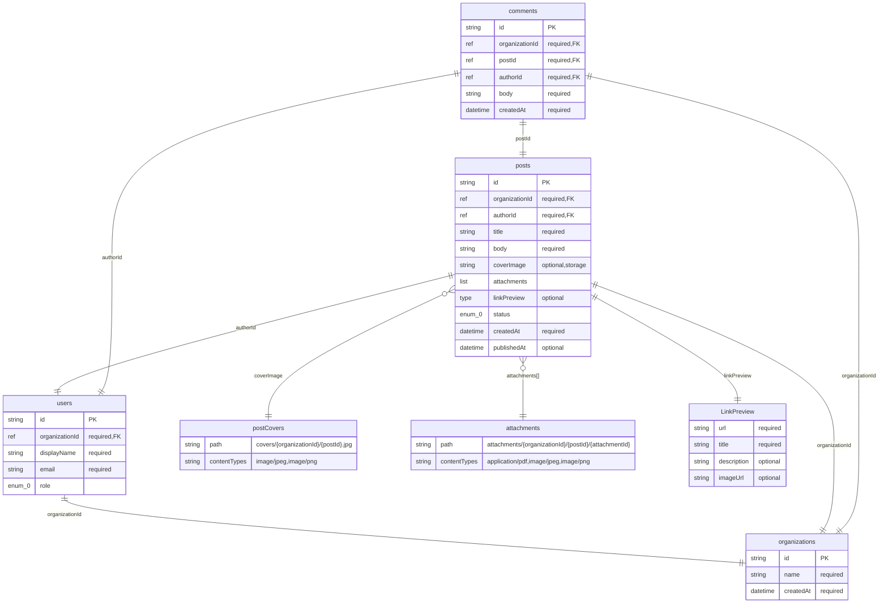

<!-- GENERATED by firepack viz — re-run, do not hand-edit. -->

```mermaid
erDiagram
  %% organizations
  organizations {
    string id "PK"
    string name "required"
    datetime createdAt "required"
  }
  %% users [tenant=organizationId]
  users {
    string id "PK"
    ref organizationId "required,FK"
    string displayName "required"
    string email "required"
    enum_0 role
  }
  %% posts [tenant=organizationId]
  posts {
    string id "PK"
    ref organizationId "required,FK"
    ref authorId "required,FK"
    string title "required"
    string body "required"
    string coverImage "optional,storage"
    list attachments
    type linkPreview "optional"
    enum_0 status
    datetime createdAt "required"
    datetime publishedAt "optional"
  }
  %% comments [tenant=organizationId]
  comments {
    string id "PK"
    ref organizationId "required,FK"
    ref postId "required,FK"
    ref authorId "required,FK"
    string body "required"
    datetime createdAt "required"
  }
  %% storage:postCovers [tenant=organizationId]
  postCovers {
    string path "covers/{organizationId}/{postId}.jpg"
    string contentTypes "image/jpeg,image/png"
  }
  %% storage:attachments [tenant=organizationId]
  attachments {
    string path "attachments/{organizationId}/{postId}/{attachmentId}"
    string contentTypes "application/pdf,image/jpeg,image/png"
  }
  %% type:LinkPreview
  LinkPreview {
    string url "required"
    string title "required"
    string description "optional"
    string imageUrl "optional"
  }
  users ||--|| organizations : "organizationId"
  posts ||--|| organizations : "organizationId"
  posts ||--|| users : "authorId"
  posts }o--|| postCovers : "coverImage"
  posts }o--|| attachments : "attachments[]"
  posts ||--|| LinkPreview : "linkPreview"
  comments ||--|| organizations : "organizationId"
  comments ||--|| posts : "postId"
  comments ||--|| users : "authorId"
```
